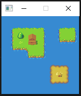

# Ebitmx

Ebitmx is a super simple parser to help [render](https://doc.mapeditor.org/en/latest/reference/tmx-map-format/) TMX maps when using [Ebiten](https://github.com/hajimehoshi/ebiten) for your games.

Please do **not** use this library in a production environment, this is under heavy development and there will be breaking changes.

This library parses a TMX file and returns a struct like the following, with the basic fields for you to render your map inside the `Draw()` function of the Ebiten main loop.

```go
type EbitenMap struct {
	TileWidth  int      // The width of the tile
	TileHeight int      // The height of the tile
	MapHeight  int      // The number of tiles in Height
	MapWidth   int      // The number of tiles in Width
	Layers     [][]int  // Layers
}
```

## Quick Start

```go

// Load the tiles image
tiles, _, err := ebitenutil.NewImageFromFile("overworld.png")
if err != nil {
	fmt.Println(err)
	os.Exit(2)
}

// Load the information of the tmx file
myMap, err := ebitmx.GetEbitenMap("map.tmx")
if err != nil {
	fmt.Println(err)
	os.Exit(2)
}

// Ready to draw! Check the examples for more info

```

## Examples

Check the example code in the [examples](./examples) folder.

Run it by
```
$ cd examples
$ go run main.go
```

A super simple map with 2 layers should load:




## Roadmap (not in order)
* Getters for simplicity
* Improve docs and tests
* Collision maps
* Out of the box "Draw()" method for simplicity (if you don't want to think, just call Draw from your code, passing ebiten "screen")
* Renderorder
* Infinite maps

## License

MIT License